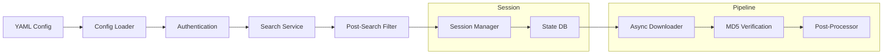

# eumdac-fetch

[](https://github.com/digital-idiot/eumdac-fetch/actions/workflows/ci.yml)
[](https://www.python.org/)
[](LICENSE)

A CLI tool for bulk downloading satellite data from EUMETSAT's Data Store using the [eumdac](https://gitlab.eumetsat.int/eumetlab/data-services/eumdac) library. Define download jobs in YAML, and eumdac-fetch handles parallel async downloads, resume/retry, MD5 verification, session management, and optional post-processing — all from the terminal.

## Features

- **Declarative YAML jobs** — define collection, filters, download settings, and post-processing in one file
- **Async parallel downloads** — configurable concurrency with `asyncio` and semaphore-based throttling
- **Resume & retry** — byte-range resume for interrupted downloads, exponential backoff retries for transient errors
- **MD5 verification** — automatic integrity checks against EUMETSAT metadata
- **Session management** — deterministic session IDs from job config; automatic resume on re-run
- **Live session detection** — sessions with recent/open-ended date ranges refresh search results automatically
- **Stale download recovery** — products stuck in DOWNLOADING state (from killed processes) are reset on resume
- **>10k result handling** — automatic date bisection when results exceed the API's 10,000-product limit
- **Post-search filtering** — thin search results before download with built-in temporal subsampling (`sample_interval`) or custom `module:factory` filters
- **Post-processing pipeline** — producer-consumer architecture with pluggable `module:function` hooks
- **Rich terminal output** — progress bars, tables, and structured logging via Rich
- **SQLite state tracking** — thread-safe, WAL-mode database tracks every product through the pipeline
- **Automatic credential discovery** — loads credentials from env vars, `.env` file, or `~/.eumdac/credentials`
- **Environment variable interpolation** — use `${ENV_VAR}` in YAML configs for paths and other values

## Architecture



## Quick Start

### Install

```bash
# Clone and install with pixi
git clone https://github.com/digital-idiot/eumdac-fetch.git
cd eumdac-fetch
pixi install
```

### Set Credentials

Get your API key and secret from the [EUMETSAT API Portal](https://api.eumetsat.int/api-key/).

Credentials are loaded automatically in priority order — no config file entry needed:

1. `EUMDAC_KEY` / `EUMDAC_SECRET` / `EUMDAC_TOKEN_VALIDITY` environment variables
2. `.env` file in the current working directory (same variable names)
3. `~/.eumdac/credentials` file (format: `key,secret` — key and secret only)

Token validity (how long each access token stays valid) defaults to 86400 seconds (24 hours). Set `EUMDAC_TOKEN_VALIDITY` in env vars or `.env` to change it, or use `--validity` on any command.

```bash
# Option 1: environment variables (recommended)
export EUMDAC_KEY="your-api-key"
export EUMDAC_SECRET="your-api-secret"
export EUMDAC_TOKEN_VALIDITY=3600   # optional: 1-hour tokens

# Option 2: .env file
echo "EUMDAC_KEY=your-api-key" >> .env
echo "EUMDAC_SECRET=your-api-secret" >> .env

# Option 3: credentials file (key and secret only)
mkdir -p ~/.eumdac
echo "your-api-key,your-api-secret" > ~/.eumdac/credentials
```

### Create a Job Config

```yaml
# job.yaml
jobs:
  - name: msg-seviri-sample
    collection: "EO:EUM:DAT:MSG:HRSEVIRI"
    filters:
      dtstart: "2024-01-01T00:00:00Z"
      dtend: "2024-01-01T12:00:00Z"
    download:
      directory: ./downloads
      parallel: 4
      resume: true
      verify_md5: true
```

### Run

```bash
# Search first (dry run)
eumdac-fetch search -c job.yaml

# Download
eumdac-fetch download -c job.yaml

# Full pipeline with post-processing
eumdac-fetch run -c job.yaml --post-processor mymodule:convert_to_cog
```

## CLI Reference

### `eumdac-fetch collections`

List all available EUMETSAT collections with titles.

```
Options:
  --key TEXT     EUMDAC API key (or set EUMDAC_KEY)
  --secret TEXT  EUMDAC API secret (or set EUMDAC_SECRET)
```

### `eumdac-fetch info <COLLECTION_ID>`

Show collection details and available search filters for a specific collection.

```
Options:
  --key TEXT     EUMDAC API key (or set EUMDAC_KEY)
  --secret TEXT  EUMDAC API secret (or set EUMDAC_SECRET)
```

### `eumdac-fetch search -c <CONFIG>`

Search and list matching products (dry run).

```
Options:
  -c, --config PATH  Job config YAML (required)
  --limit INTEGER    Max products to show per job (default: 50)
  --count-only       Only show product counts
```

### `eumdac-fetch download -c <CONFIG>`

Download products defined in job config.

```
Options:
  -c, --config PATH  Job config YAML (required)
```

### `eumdac-fetch run -c <CONFIG>`

Full pipeline: search, download, and post-process.

```
Options:
  -c, --config PATH       Job config YAML (required)
  --post-processor TEXT   Post-processor as 'module:function'
```

## Configuration Reference

```yaml
# Logging
logging:
  level: INFO          # DEBUG, INFO, WARNING, ERROR
  file: fetch.log      # Optional log file path

# Jobs — one or more download jobs
jobs:
  - name: my-job                          # Job identifier
    collection: "EO:EUM:DAT:MSG:HRSEVIRI" # EUMETSAT collection ID
    limit: 100                             # Max products (null for all)

    # Search filters (all optional)
    filters:
      dtstart: "2024-01-01T00:00:00Z"     # Start datetime (ISO 8601)
      dtend: "2024-01-31T23:59:59Z"       # End datetime (ISO 8601)
      geo: "POLYGON((...))"               # WKT geometry filter (Well Known Text)
      bbox: "-180,-90,180,90"             # Bounding box (min_lon, min_lat, max_lon, max_lat)
      sat: "MSG4"                         # Satellite name
      timeliness: "NT"                    # Timeliness (NT, NRT, etc.)
      filename: "*.nat"                   # Filename pattern
      title: "*HRFI*"                     # Wildcard search on product identifier
      cycle: 1                            # Repeat cycle number
      orbit: 12345                        # Orbit number
      relorbit: 100                       # Relative orbit number
      product_type: "HRSEVIRI"            # Product type
      type: "MTIFCI1CRRADHRFI"            # Alternative product type field
      publication: "R"                    # Publication status
      download_coverage: "full"           # Download coverage
      coverage: "FD"                      # Coverage (FD=Full Disc, RSS=Rapid Scan)
      repeatCycleIdentifier: "1"          # Repeat cycle identifier
      centerOfLongitude: "0.0"            # Sub-satellite longitude
      set: "full"                         # Element set (full or brief)
      sort: "start,time,1"               # Sort order (default)

    # Download settings
    download:
      directory: ./downloads              # Download directory (relative to config file)
      parallel: 4                         # Concurrent downloads
      resume: true                        # Resume interrupted downloads
      verify_md5: true                    # Verify MD5 after download
      max_retries: 3                      # Max retry attempts
      retry_backoff: 2.0                  # Base backoff in seconds (exponential)
      timeout: 300                        # Per-product download timeout in seconds

    # Post-search filter — applied after search, before download
    post_search_filter:
      type: sample_interval               # Built-in: keep one product per N-hour bucket
      interval_hours: 3                   # Extra keys become filter params

    # Post-processing (used with `run` command)
    post_process:
      enabled: false                      # Enable post-processing
      output_dir: ./output                # Output directory for processed files
```

## Session & Resume

eumdac-fetch uses **deterministic sessions** for automatic resume:

1. A **session ID** is computed as a SHA-256 hash of the job configuration (excluding credentials)
2. The same YAML config always produces the same session, so re-running resumes automatically
3. Session state is stored in `~/.eumdac-fetch/sessions/<session-id>/`:
   - `state.db` — SQLite database tracking product status
   - `session.log` — session-scoped log file
   - `config.yaml` — frozen copy of the job config

**Live sessions**: if `dtend` is within 3 hours of now (or unset), the session is "live" and search results are refreshed on each run instead of using cached results.

**Stale download recovery**: products left in DOWNLOADING status from a killed process are automatically reset to PENDING on the next run.

## Post-Processing

The `run` command supports pluggable post-processing via `--post-processor module:function`. The function signature must be:

```python
def my_processor(download_path: Path, product_id: str) -> None:
    """Process a downloaded product file."""
    ...
```

The pipeline uses an async producer-consumer architecture: downloads feed into a queue, and the post-processor consumes verified products. Products transition through states:

```
PENDING → DOWNLOADING → DOWNLOADED → VERIFIED → PROCESSING → PROCESSED
                                                           ↘ FAILED
```

## Post-Search Filters

Add a `post_search_filter` block to a job to thin the product list **after search but before download**. The filtered set is what gets cached and downloaded — useful for high-cadence collections where you only need a sample.

```yaml
jobs:
  - name: mtg-fci-3h
    collection: "EO:EUM:DAT:0665"
    filters:
      dtstart: "2025-01-01T00:00:00Z"
      dtend:   "2026-01-01T00:00:00Z"
    post_search_filter:
      type: sample_interval   # built-in: one product per time bucket
      interval_hours: 3
```

For a user-defined filter, reference any importable factory as `module:factory`:

```yaml
post_search_filter:
  type: mypackage.filters:daytime_only_factory
  solar_elevation_min: 10
```

Or register a short alias from Python and use it by name:

```python
from eumdac_fetch import register, PostSearchFilterFn

def daytime_factory(solar_elevation_min: float) -> PostSearchFilterFn:
    return lambda products: [p for p in products if ...]

register("daytime_only", daytime_factory)
```

## Development

```bash
# Install with dev dependencies
pixi install -e dev

# Run tests
pixi run -e dev test

# Lint
pixi run -e dev lint

# Format
pixi run -e dev format

# Build docs
pixi install -e docs
pixi run -e docs docs
```

## License

MIT
